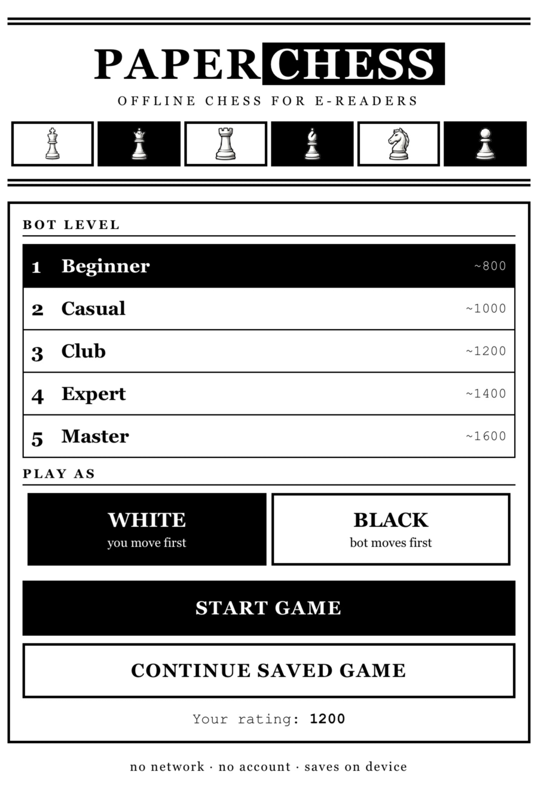

# PaperChess

Offline chess vs bot, designed for Kindle e-ink browsers.

  

## What it is

A self-contained chess game with its own rules engine, bot, and interface.
Play against the engine or share one device in two-player mode. One page,
one screen, no scrolling, no network calls — everything runs locally in the
browser.

## Kindle-first design

- **Two modes** — play the bot at 5 levels, or two players on one device
- **ES5, zero dependencies** — runs on old WebKit
- **Engraved piece sprites** — high-contrast transparent PNGs for grayscale
  e-ink screens
- **Two screens** — dedicated setup and zero-scroll play screens
- **Partial repaints** — only changed squares redraw after each move
- **Big targets** — whole square is the tap area, with 42px+ buttons
- **Auto-fit** — board sizes to the viewport on load and resize
- **Autosave** — game state and ELO use guarded localStorage for Kindle
  firmware compatibility

## Architecture

- [`index.html`](index.html) — application entry point
- [`js/engine.js`](js/engine.js) — chess rules and notation
- [`js/ai.js`](js/ai.js) — computer opponent (5 levels)
- [`js/app.js`](js/app.js) — interface and game flow
- [`css/paperchess.css`](css/paperchess.css) — Kindle-first presentation
- [`img/`](img/) — local piece artwork

## Play

- Tap piece → tap marked target (dots = moves, double ring = captures)
- Two players: pick 2 PLAYERS on the setup screen and pass the device
- Castle: tap king, then the g/c square
- Undo: takes back your move + bot's reply
- Rating: your local player rating rises with wins over stronger levels

## Contributing

Issues and pull requests are welcome. Keep changes dependency-free, compatible
with ES5-era WebKit, and usable on slow grayscale e-ink displays.

## License

PaperChess is available under the [MIT License](LICENSE).

---

Made by [8ugust.dev](https://8ugust.dev)
